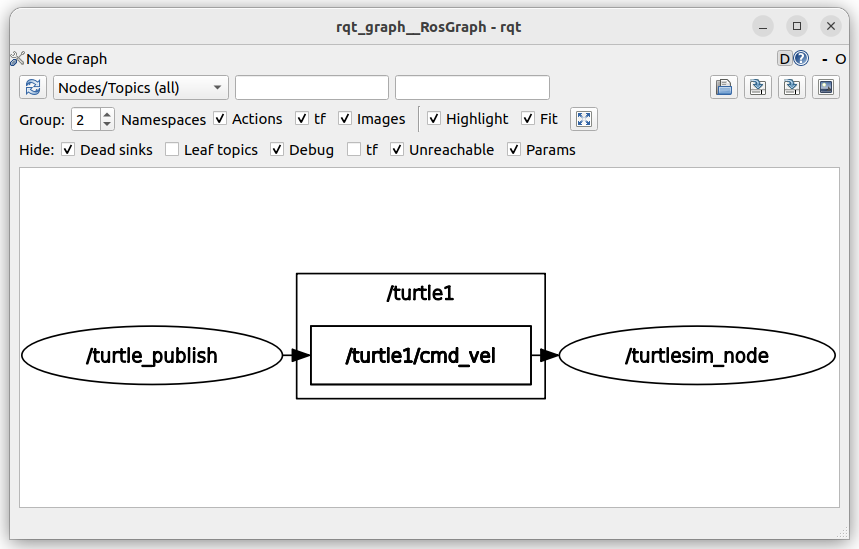
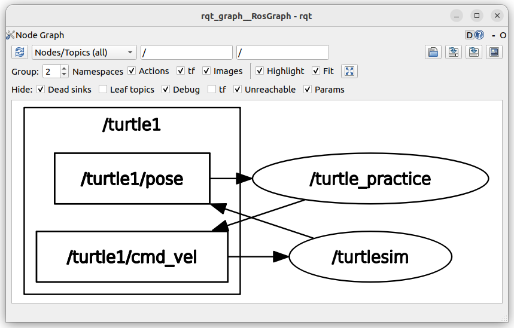

# turtle_sample2

## 概要
ROS2学習のためのturtlesimを用いたサンプルプログラム．
turtle_practiceパッケージを作成して，パッケージ確認順に沿って編集していくことでLaunch，Topic(publish,subscrive)，Service(client), Parameterの順で学べる

# 座学

## Nodeと様々な通信方法
### Node

- 1つのノードには、複数の通信を実装できる

### Topic

- publisherとsubscriberが、トピックを通じで通信を行う
- publisher-subscriber model
- `rqt_graph`で表示させることができる
- publisherはよくtimerで定期送信される

### Service

- service(serverの方が表現が適切だと思う)とclientがサービスを通じて通信を行う
- call-and-response model
- `rqt_graph`で表示させることができない

### Parameter
- パラメータは各ノードが保持している値のこと
- 各ノードの設定を行うための値を持たせることが多い
- コマンドからパラメータを操作可能だが、その場合はコールバックで呼ぶ必要あり

### Action


## 通信範囲
- ROS2では同じネットワーク内のROSノードと自動的に通信可能
- 同じネットワーク内で複数のROSプロジェクトが動作する場合はROSプロジェクトごとにROS_DOMAIN_IDを設定する必要がある
- ROS_DOMAIN_IDは0-101の中から選択すればよい

```sh
echo "export ROS_DOMAIN_ID=<your_domain_id>" >> ~/.bashrc
```

- ローカルホスト内でROSプロジェクトが完結している場合は、ROS_LOCALHOST_ONLYを1に設定すればよい
- Iron以降のROSでは、ROS_AUTOMATIC_DISCOVERY_RANGEで設定可能
- https://docs.ros.org/en/jazzy/Tutorials/Advanced/Improved-Dynamic-Discovery.html
```sh
echo "export ROS_LOCALHOST_ONLY=1" >> ~/.bashrc
```

## namespace
```sh
/
├── turtle1
│   ├── controller (node)
│   │   ├── speed (parameter)
│   │   ├── pid.kp (parameter)
│   │   └── pid.kd (parameter)
│   └── cmd_vel (topic)
└── turtle2
    ├── controller (node)
    └── cmd_vel (topic)
```

- ノード、トピック、サービス、アクション、パラメータは階層構造で管理されている
  - パラメータは必ずノードの配下に存在する
  - パラメータ名前空間(parameter namespace)は`.`で区切る
- 完全修飾名(Fully Qualified Names)とは、絶対指定したもので、一意に特定できる
  - 完全修飾ノード名
  - 完全修飾トピック名
  - 完全修飾アクション名
  - 完全修飾サービス名
- 指定方法
  - 絶対指定
    - `/`で始まる
    - `~`または`{}`を含んではいけない
  - 相対指定
    - `/`と`~`以外で始まる
    - トピック、サービス、アクションが、相対指定の場合、ノードの名前空間直下に作られる
- 特殊な記号
  - `~`
    - プライベート名前空間置換文字(Private Namespace Substitution Character)
    - 完全修飾ノード名を表す(ノードの名前空間/ノード名)
  - `{}`
    - 置換(Substitutions)
    - `{node}`現在のノード名に置換される
    - `{ns}`現在のネームスペースに置換される
- ノードは相対指定でしか、表現できない
  - ノードの名前空間を操作する方法
    - Nodeコンストラクタの第2引数に指定
    - launchファイルから指定


| 識別名       | 絶対指定 | 相対指定 | プライベート名前空間置換 |
| :----------- | :------- | :------- | :----------------------- |
| ノード名     | X        | O        | X                        |
| トピック名   | O        | O        | O                        |
| サービス名   | O        | O        | O                        |
| アクション名 | O        | O        | O                        |


## パッケージ作成までのコマンド
```sh
# ワークスペース作成
mkdir -p ~/<ワークスペース名>/src
cd <ワークスペース名>
colcon build
source install/setup.bash

# パッケージ作成
cd ~/<パッケージを配置するフォルダ>   
ros2 pkg create <パッケージ名> --build-type <ビルドタイプ> --dependencies <依存パッケージ>
  # ビルドタイプはament_cmake
  # 依存パッケージはrclcpp, std_msgs, ...

# ビルド
cd ~/<ワークスペース名>  
colcon build  
source install/setup.bash

# 実行
ros2 run <パッケージ名> <ノード名>
```

## デバッグコマンド
### launch関係
```sh
# launchの実行
ros2 launch <package_name> <launch_file_name>

# launchの実行(launchファイルが配置されたディレクトで実行)
ros2 launch <launch_file_name>
```

### Node関係
```sh
# 起動しているNodeの確認
ros2 node list

# Nodeの詳細確認
ros2 node info
```

### Topic関係
```sh
# 存在するTopicの確認
ros2 topic list

# Topicの通信状況の確認
ros2 topic echo <topic名>

# Topicの詳細確認
ros2 topic info <topic名>

# Topicへ送信
ros2 topic pub <topic名> <topic通信の型> <通信データ>
```

### Service関係
```sh
# 存在するServiceの確認
ros2 service list

# Service通信の型の確認
ros2 service type

# Serviceへ送信
ros2 service call <service名> <service通信の型> <通信データ>
```

### Parameter関係
```sh
# Parameterの一覧確認
ros2 param list

# Parameterのセット
ros2 param set <node名> <parameter名> <設定値>

# Parameterの設定値確認
ros2 param get <node名> <parameter名>

# Parameterの保存
ros2 param dump <node名> > <保存ファイルへのパス>　   

# 例
ros2 param dump /turtle_control > ~/turtle_ws/wrc/turtle_sample2/turtle_control/config/params.yaml
```

### 通信の型関係
```sh
# 通信の型に含まれる変数の確認
ros2 interface show <通信の型>　

# 例
ros2 interface show geometry_msgs/msg/Twist
```

### グラフ関係
```sh
# グラフの表示
rqt_graph
```

## 参考
- https://docs.ros.org/en/foxy/Tutorials.html
- https://docs.ros.org/en/foxy/index.html

# 実践編
## フォルダ構成
```sh
~/turtle_ws     
　　/build　　　　# システムトラブル時は削除      
　　/include　　　# システムトラブル時は削除      
　　/src    
　　　　/<パッケージ名>　　# パッケージは必ず/##_ws/src下に配置
　　　　　　/config　　　# parameterファイル置き場   
　　　　　　/launch　　　# launchファイル置き場　   
　　　　　　/src　　　　　#ソースファイル置き場　   
　　　　　　　　/<パッケージ名>.cpp 
        /sample2
            /turtle_publish  # 今回のパッケージ(パッケージはワークスペース名/src配下ならディレクト内でも良い)
                /src
                    /turtle_publish.cpp
                /CMakeLists.txt
                /package.xml
　　　　/CMakeLists.txt     
　　　　/package.xml
```

## パッケージ確認順
1. turtle_publish
2. turtle_subscribe
3. turtle_client
4. turtle_parameter

## サンプルコードの実行方法
```sh
# ワークスペースの作成
mkdir -p ~/turtle_ws/src     
cd turtle_ws     
colcon build  
source install/setup.bash

# パッケージのクローン
cd turtle_ws/src
git clone https://github.com/Kousuke-Okabe/turtle_sample2.git

# ビルド
cd ~/turtle_ws
colcon build

# 実行
shell-1> source install/setup.bash
shell-1> ros2 run turtle_publish turtle_publish

shell-2> source install/setup.bash
shell-2> ros2 run turtlesim turtlesim_node
```

## サンプルコードの解説
### 1.turtle_publish

- `turtle1/cmd_vel`トピックにTwistメッセージを送ると、カメの速度を設定できる
- `Twist.linear.x`の値は、カメから見て前後の速度を表す
- `Twist.linear.y`の値は、カメから見て左右の速度を表す
- `Twist.angular.z`の値は、回転方向の速度を表す
- 2次元なので、上記以外の座標軸に値を設定しても無視される

geometry_msgs::msg::Twist
```msg
# 並進速度(x, yのみ有効)
geometry_msgs::msg::Vector3 linear;
# 角速度(zのみ有効)
geometry_msgs::msg::Vector3 angular;
```

geometry_msgs::msg::Vector3
```msg
float64 x
float64 y
float64 z
```

### 2.turtle_subscribe

- `turtle1/pose`トピックのPoseメッセージから、カメの位置情報, 速度情報を受け取ることができる
- この情報を用いて、目標の位置(ref_x, ref_y)に対してP制御(ゲインKp)を行っている

turtlesim::msg::Pose
```msg
# カメのx座標
float32 x
# カメのy座標
float32 y
# カメの角度(rad)
float32 theta

# 並進速度
float32 linear_velocity
# 角速度
float32 angular_velocity
```

### 3.turtle_client
- `turtle1/set_pen`サービスにSetPenメッセージを送ると、カメが通った後にできる線の色、幅、線の有無を設定できる

turtlesim::srv::SetPen
```srv
# 線の色(RGB)
uint8 r
uint8 g
uint8 b
# 線の幅
uint8 width
# 線の有無(0:線あり, 1:線なし)
uint8 off
---
```

### 4.turtle_parameter
- パラメータの値を指定して起動することができる
- サンプルプログラムでは、`Kp`, `ref_x`, `ref_y`を指定できる
```sh
ros2 run <パッケージ名> <ノード実行ファイル名> --ros-args -p <パラメータ名>:=<値>
```
